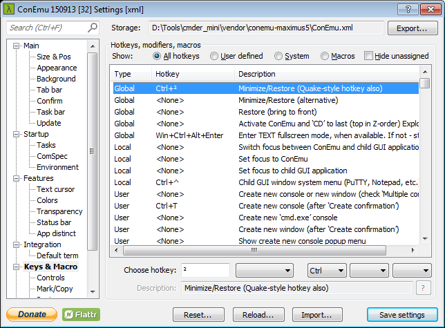

## Cmder - Portable console emulator for Windows

[https://github.com/Starli0n/Tool_Cmder](https://github.com/Starli0n/Tool_Cmder)

{:toc}


### Install

* [Download Cmder (mini)](http://cmder.net) (v1.3.2)
* Copy exe to `%TOOLS%\cmder_mini\`
* Add environment variables `%CMDER_ROOT% = %TOOLS%\cmder_mini`
* Change to a [powerline prompt](https://github.com/AmrEldib/cmder-powerline-prompt)
	* Install the `Hack` font from `%CMDER_ROOT%\vendor\powerline-fonts\Hack\Hack-Regular.ttf
	* Download the `powerline_prompt.lua` file, and place it in `%CMDER_ROOT%\config` folder
	* Restart Cmder
	* Change the font in the settings


### Aliases

* Edit `%CMDER_ROOT%\config\user-aliases.cmd` to add some [aliases](https://github.com/Starli0n/Tool_Cmder/blob/master/config/user-aliases.cmd)


### Settings

* `Main > Size & Pos`

☑ Auto save window size and position on exit


* `Keys & Macro`

| Type    | Hotkey        | Description                                |
|---------|---------------|--------------------------------------------|
| Global  | Ctrl+²        | Minimize/Restore (Quake-style hotkey also) |
| User    | <None>        | Move active tab leftward                   |
| User    | <None>        | Move active tab rightward                  |
| Macro12 | Win+Alt+Left  | Tab(4, -1); Tab(1);                        |
| Macro13 | Win+Alt+Right | Tab(4, 1); Tab(1);                         |




### Integrate Cmder and Sublime Text seamlessly

[a-neat-way-integrate-cmder-and-sublime-text-seamlessly](http://laravel.io/forum/02-24-2014-a-neat-way-integrate-cmder-and-sublime-text-seamlessly)

* Download a portable version of Sublime Text 3 from [their website](https://www.sublimetext.com/3)
* Extract to `%CMDER_ROOT%\vendor\SublimeText`
* Use `sub` to use Sublime Text integrated to Cmder or `subl` to use the general one.

#### Sublime Text 3 - Settings

* `View > Hide Menu`
* `View > Hide Tabs`
* Open `Preferences > Settings - User`

````
// Settings in here override those in "Default/Preferences.sublime-settings",
// and are overridden in turn by file type specific settings.
{
    "close_windows_when_empty": true,
    "hot_exit": false,
    "remember_open_files": false
}
````


### Upgrade

* Backup folder to `%TOOLS%\cmder_mini_bak\`
* Extract the new exe to `%TOOLS%\cmder_mini\`
* `> copy %TOOLS%\cmder_mini_bak\config\user-aliases.cmd %TOOLS%\cmder_mini\config\user-aliases.cmd`
* `> copy %TOOLS%\cmder_mini_bak\config\powerline_prompt.lua %TOOLS%\cmder_mini\config\powerline_prompt.lua`
* `> echo d | xcopy %TOOLS%\cmder_mini_bak\vendor\SublimeText %TOOLS%\cmder_mini\vendor\SublimeText /e`
* Apply the settings

---

[[HOME]](../index.html)
