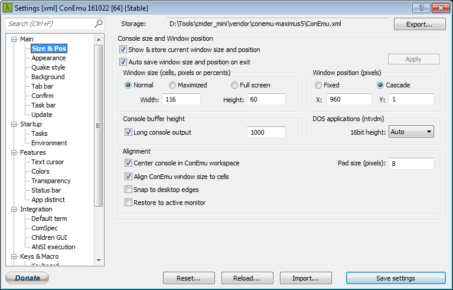

## Cmder - Portable console emulator for Windows

[https://github.com/Starli0n/Tool_Cmder](https://github.com/Starli0n/Tool_Cmder)

{:toc}


### Install

* [Download Cmder (mini)](http://cmder.net) (v1.2.9)
* Copy exe to `%TOOLS%\cmder_mini\`
* Add environment variables `%CMDER_ROOT% = %TOOLS%\cmder_mini`


### Init

* Edit `%CMDER_ROOT%\vendor\init.bat`

Assuming `%TOOLS%\PortableGit`, replace

````
:: Check if msysgit is installed
@if exist "%ProgramFiles%\Git" (
    set "GIT_INSTALL_ROOT=%ProgramFiles%\Git"
) else if exist "%ProgramFiles(x86)%\Git" (
    set "GIT_INSTALL_ROOT=%ProgramFiles(x86)%\Git"
) else if exist "%CMDER_ROOT%\vendor" (
    set "GIT_INSTALL_ROOT=%CMDER_ROOT%\vendor\git-for-windows"
)
````

by

````
:: Check if msysgit is installed
@if exist "%TOOLS%\PortableGit" (
    set "GIT_INSTALL_ROOT=%TOOLS%\PortableGit"
) else if exist "%ProgramFiles%\Git" (
    set "GIT_INSTALL_ROOT=%ProgramFiles%\Git"
) else if exist "%ProgramFiles(x86)%\Git" (
    set "GIT_INSTALL_ROOT=%ProgramFiles(x86)%\Git"
) else if exist "%CMDER_ROOT%\vendor\git-for-windows" (
    set "GIT_INSTALL_ROOT=%CMDER_ROOT%\vendor\git-for-windows"
)
````


* Remove `%GIT_INSTALL_ROOT%\usr\bin;` because `which` does not do its job (use `which=gs which $*` in `aliases` instead)

````
:: Add git to the path
@if defined GIT_INSTALL_ROOT (
    ::%GIT_INSTALL_ROOT%\usr\bin;
    set "PATH=%GIT_INSTALL_ROOT%\bin;%GIT_INSTALL_ROOT%\share\vim\vim74;%PATH%"
    :: define SVN_SSH so we can use git svn with ssh svn repositories
    if not defined SVN_SSH set "SVN_SSH=%GIT_INSTALL_ROOT:\=\\%\\bin\\ssh.exe"
)
````


### Aliases

* Edit `%CMDER_ROOT%\config\aliases` to add some [aliases](https://github.com/Starli0n/Tool_Cmder/blob/master/config/aliases)
* Fixing the [issue](https://github.com/cmderdev/cmder/issues/684) with expanding environment variables in aliases
    * Backup `%CMDER_ROOT%\vendor\clink`
    * Replace by [this one](https://www.dropbox.com/sh/hqbrpkf0dpmmizq/AADIJ4G5gjJ59JfFmr-3-Qc0a/20150923_1abb57/clink_DEV.zip?dl=0)

### Settings

* `Main > Size & Pos`
☑ Auto save window size and position on exit



* `Keys & Macro`
Global Ctrl+² Minimize/Restore (Quake-style hotkey also)


### Integrate Cmder and Sublime Text seamlessly

[a-neat-way-integrate-cmder-and-sublime-text-seamlessly](http://laravel.io/forum/02-24-2014-a-neat-way-integrate-cmder-and-sublime-text-seamlessly)

* Download a portable version of Sublime Text 3 from [their website](https://www.sublimetext.com/3)
* Extract to `%CMDER_ROOT%\vendor\SublimeText`
* Use `sub` to use Sublime Text integrated to Cmder or `subl` to use the general one.

#### Sublime Text 3 - Settings

* `View > Hide Menu`
* `View > Hide Tabs`
* Open `Preferences > Settings - User`

````
// Settings in here override those in "Default/Preferences.sublime-settings",
// and are overridden in turn by file type specific settings.
{
    "close_windows_when_empty": true,
    "hot_exit": false,
    "remember_open_files": false
}
````

---

[[HOME]](../index.html)
