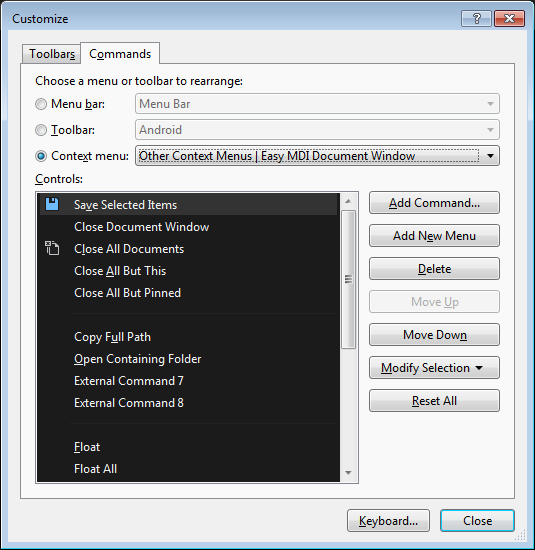
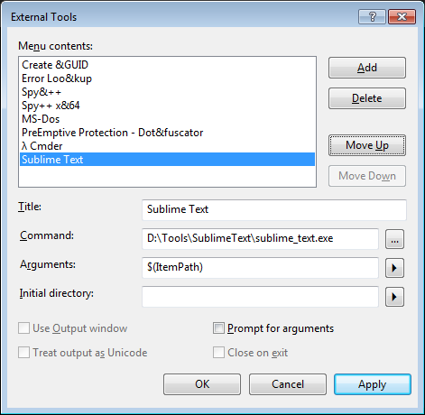

## Visual Studio

[https://www.visualstudio.com](https://www.visualstudio.com)

{:toc}

### Settings

`Tools > Options...`

* `Environment`
	* `Keyboard`  
	

* `Projects and Solutions` >  
	☑ `Track Active Item in Solution Explorer`

* `Source Control`
	* `Visual Studio Team Foundation Server` > `[Configure User Tools...]`
	 
	Command: `C:\Program Files (x86)\WinMerge\WinMergeU.exe` 
	Arguments: `/ub /dl %6 /dr %7 %1 %2`

* `Text Editor`
	* `All Languages`  
	☑ `Line numbers`
		* `Scroll Bars` 
		

Using double click to compare instead of opening  
`HKCU\Software\Microsoft\VisualStudio\14\TeamFoundation\SourceControl\Behavior\DoubleClickOnChange (DWORD) 1`

### Customize

* `Tools > Customize...`

* `[Add Command...]`

`External Command 7`: Cmder 
`External Command 8`: Sublimet Text

#### Cmder

* Title: `λ Cmder`
* Command: `%CMDER_ROOT%\vendor\conemu-maximus5\ConEmu.exe`
* Arguments: `"/here" /icon %CMDER_ROOT%\icons\cmder.ico /single /cmd cmd /k "%CMDER_ROOT%\vendor\init.bat"`
* Initial directory: `$(ItemDir)`

#### Sublime Text

* Title: `Sublime Text`
* Command: `%TOOLS%\SublimeText\sublime_text.exe`
* Argument: `$(ItemPath)`

### Clean Recent Items

Erase the registry key `[HKEY_CURRENT_USER\Software\Microsoft\VisualStudio\14.0\MRUItems]` using [`%TOOLS%\System\VSCleanRecent.reg`](https://github.com/Starli0n/Tool_System/blob/master/VSCleanRecent.reg) or the alias [`vsclean`](https://github.com/Starli0n/Tool_Cmder/blob/master/config/user-aliases.cmd)

### Extensions

`Tools > Extensions and Updates...`

* [Browser Reload on Save](https://visualstudiogallery.msdn.microsoft.com/46eef4d9-045b-4596-bd7f-eee980bb5450)
* [CodeMaid](http://www.codemaid.net)
* [Favorite Documents](https://vlasovstudio.com/favorite-documents)
* [GitFlow for Visual Studio 2015](https://visualstudiogallery.msdn.microsoft.com/f5ae0a1d-005f-4a09-a19c-3f46ff30400a)
* [Go To Definition](https://marketplace.visualstudio.com/items?itemName=NoahRichards.GoToDefinition)
* [Markdown Editor](https://github.com/madskristensen/MarkdownEditor)
* [Microsoft Visual Studio Team Foundation Server 2015 Power Tools](https://visualstudiogallery.msdn.microsoft.com/898a828a-af00-42c6-bbb2-530dc7b8f2e1)
* [MixEdit](http://www.codinglabs.net/MixEdit.aspx)
* [NUnit 3 Test Adapter](https://visualstudiogallery.msdn.microsoft.com/0da0f6bd-9bb6-4ae3-87a8-537788622f2d)
* [PHP Tools for Visual Studio](https://www.devsense.com)
* [Productivity Power Tools 2015](https://visualstudiogallery.msdn.microsoft.com/34ebc6a2-2777-421d-8914-e29c1dfa7f5d)
* [Test Generator NUnit extension](https://visualstudiogallery.msdn.microsoft.com/bd30bf3f-4183-4b00-a245-1875316b8cd3)
* [Web Essentials](http://vswebessentials.com)
* [Web Extension Pack](https://visualstudiogallery.msdn.microsoft.com/f3b504c6-0095-42f1-a989-51d5fc2a8459)

---

[[HOME]](../index.html)
