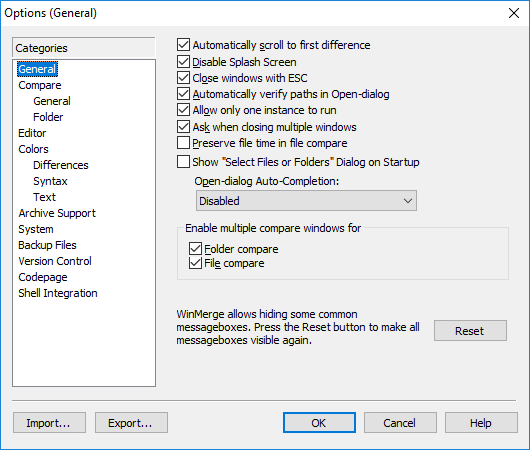
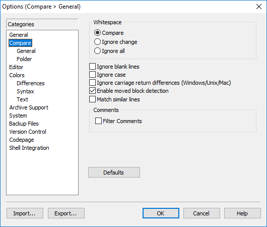
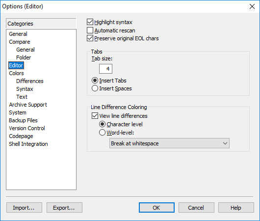
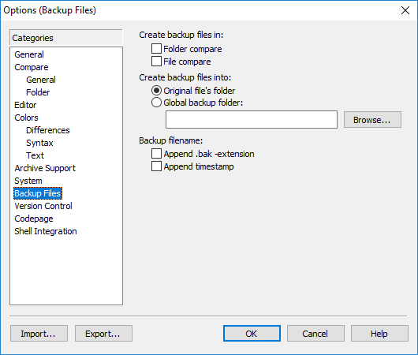
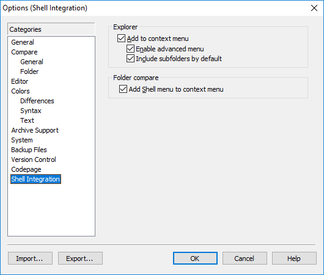

## WinMerge 2.14.0

[http://winmerge.org](http://winmerge.org)

{:toc}

### Options

### Exported Configuration

[WinMergeExportedConfig.ini](WinMergeExportedConfig.ini)

### Filters

* [SublimeText](https://github.com/Starli0n/SublimeUser3/blob/master/Resources/Windows/Tools/SublimeTextWinmergeFilter.flt)

---

[[HOME]](../index.html)
