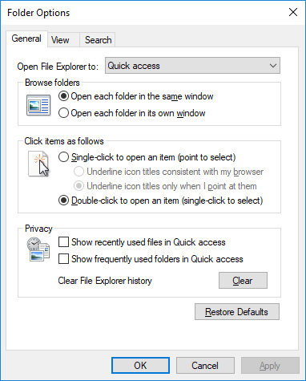
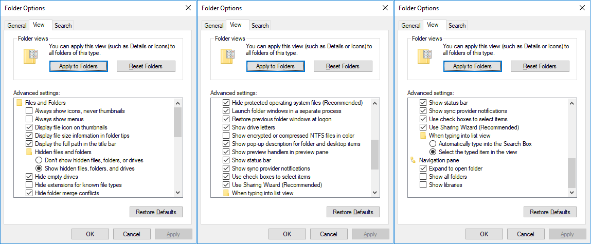
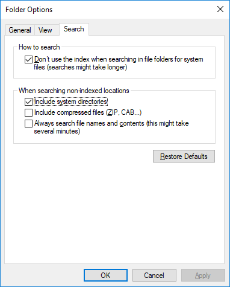

## Windows 10

{:toc}

### Install

TODO

### Explorer

* Install [Clover](http://en.ejie.me)
* `Ctrl + B` to remove bookmarks
* Quick access
	* Starli0n
	* Downloads
	* Tools
	* Documents
	* Local Disk
* `%APPDATA%\Microsoft\Windows\Network Shortcuts`
	* Starli0n
	* Tools

### Folder Options

### Windows Settings

#### System

#### Personalization

* Colors
	* Choose your default app mode
		* Dark

* Taskbar
	* Select which icons appear on the taskbar
	* Show taskbar buttons on
		* Taskbar where window is open
	* People
		* Show contacts on the taskbar
			* Off

	* OneDrive > Settings > Settings > Start OneDrive automatically

#### Apps

* Default apps
	* Web browser
		* Firefox

#### Time & Language

* Date & time
	* Change date and time formats
		* First day of the week
			* Monday
		* Short date
			yyyy-MM-dd
		* Short date
			yyyy-MM-dd
		* Short time
			HH:mm
		* Long time
			HH:mm:ss

* Region & language
	* Languages
		English > Options > Add French Keyboard / Remove others

#### Privacy

* General
	* Change privacy options
		* Off

* Let apps use...
	* Off

* Feedback & diagnostics
	* Basic
	* Off
	* Never

#### Update & Security

* Windows Update
	* Change active hours
	* Advanced options
		* Delivery Optimization
			* Allow downloads from other PCs
				* Off

#### Search

* Permissions & History
	* Windows Cloud Search
		* Off
	* My device history
		* Off

### Icons

[Dll containing icons](https://www.digitalcitizen.life/where-find-most-windows-10s-native-icons)
* `%SystemRoot%\System32\SHELL32.dll`
* `%systemroot%\system32\imageres.dll`

### Registry

* Folder Options > View > Advanced settings
	* `HKEY_CURRENT_USER\Software\Microsoft\Windows\CurrentVersion\Explorer\Advanced`

* User environment variables
	* `HKEY_CURRENT_USER\Environment`

* System environment variables
	* `HKEY_LOCAL_MACHINE\SYSTEM\CurrentControlSet\Control\Session Manager\Environment`

* Wordpad - Recent File List
	* `HKEY_CURRENT_USER\Software\Microsoft\Windows\CurrentVersion\Applets\Wordpad\Recent File List`

---

[[HOME]](../index.html)
