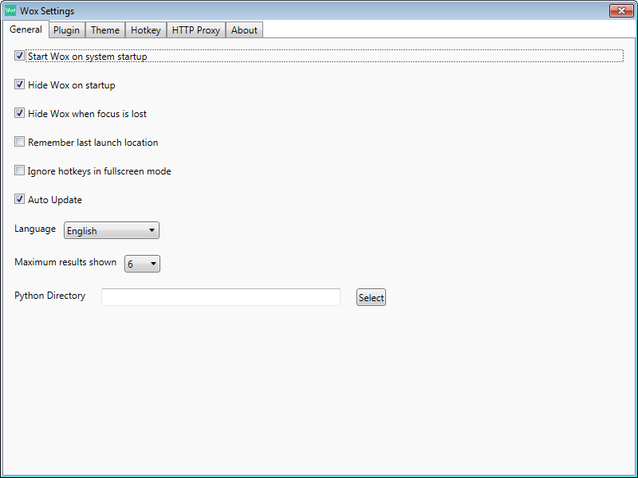

## Wox - An effective launcher for windows

### Install

 * [Download Wox](http://www.getwox.com)
 * Copy exe to `%TOOLS%\Wox\Wox.exe`

Personal settings are located in `%AppData%\Wox\` directory. [(No more Portable version)](https://github.com/Wox-launcher/Wox/issues/629)

Be aware that at that time (v.1.3.67), Wox does not [expand environment variables](https://github.com/Wox-launcher/Wox/issues/816)

[[Wox Documentation]](http://doc.getwox.com/en/index.html)

---

### Settings

#### General




#### Plugin


* Hello World CSharp <br/>
    ☑ Disable

* Hello World Python <br/>
    ☑ Disable

* Everything <br/>
    ☑ Disable

* Folder
    * `C:\xampp\htdocs\boilerplatedownloader`
    * `D:\Dev`
    * `D:\Downloads`
    * `D:\Source`
    * `D:\Tools`<br/>
    `%AppData%\Wox\Settings\Plugins\Wox.Plugin.Folder\Settings.json`

````
{
  "FolderLinks": [
    {
      "Path": "C:\\xampp\\htdocs\\boilerplatedownloader"
    },
    {
      "Path": "D:\\Dev"
    },
    {
      "Path": "D:\\Downloads"
    },
    {
      "Path": "D:\\Source"
    },
    {
      "Path": "D:\\Tools"
    }
  ]
}
````

* Program
    * `%TOOLS%\FirefoxPortable`
    * `%TOOLS%\System`
    * `%TOOLS%\cmder_mini`
    * `%TOOLS%\SublimeText`<br/>
    (Add with `Max Depth = 0`)<br/>
    `%AppData%\Wox\Settings\Plugins\Wox.Plugin.Program\Settings.json`


* Web Searches
    * Rename `lucky` to `l`

Title | Action keywords | URL
------|-----------------|----
`WordReference` | `wr` | `http://www.wordreference.com/enfr/{q}`
`Les Numériques` | `num` | `http://www.lesnumeriques.com/recherche?q={q}`


#### Theme

* Dark


#### Hotkey

Wox Hotkey `Alt + Space`

Hotkey | Action keywords | Action
-------|-----------------|-------
`Ctrl + Shift + V` | `cb·` | Clipboard
`Alt + G` | `g·` | Google search
`Alt + L` | `l·` | Google Lucky
`Alt + T` | `wr·` | Wordreference

Or in `%AppData%\Wox\Settings\Settings.json`

````
  "CustomPluginHotkeys": [
    {
      "Hotkey": "Ctrl + Shift + V",
      "ActionKeyword": "cb "
    },
    {
      "Hotkey": "Alt + G",
      "ActionKeyword": "g "
    },
    {
      "Hotkey": "Alt + T",
      "ActionKeyword": "wr "
    },
    {
      "Hotkey": "Alt + L",
      "ActionKeyword": "l "
    }
  ]
````


#### Proxy

Server `proxy.com` Port `8080`

---

### Install plugins

[Install plugin](http://doc.getwox.com/en/plugin/install_plugin.html) `wpm install <plug-in name>`

* `wpm install Clipboard History`
* `wpm install Dash.Doc`
* `wpm install Remove USB`
* `wpm install Wox.Plugin.ProcessKiller`
* `wpm install Wox.Plugin.Runner`

[Plugin list](http://www.getwox.com/plugin)

---

[[HOME]](../index.html)
