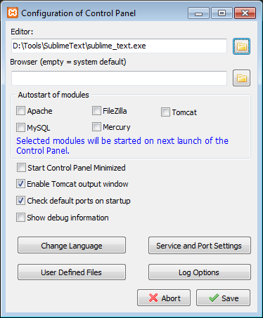

## XAMPP - the most popular PHP development environment

[XAMPP Apache + MariaDB + PHP + Perl](https://www.apachefriends.org)

{:toc}

### Settings

[Config] Button

Editor: `D:\Tools\SublimeText\sublime_text.exe`



Download `https://curl.haxx.se/ca/cacert.pem` to `C:\xampp\php\extras\ssl\cacert.pem`

* Backup `C:\xampp\php\php.ini` to `C:\xampp\php\php.bak.ini`
* Backup `C:\xampp\apache\conf\httpd.conf` to `C:\xampp\apache\conf\httpd.bak.conf`
* Edit `C:\xampp\php\php.ini`

```
[curl]
curl.cainfo = "C:\xampp\php\extras\ssl\cacert.pem"

[xdebug]
zend_extension = "C:/xampp/php/ext/php_xdebug-2.4.0-7.0-vc14.dll"
xdebug.idekey=sublime.xdebug
xdebug.remote_enable=1
xdebug.show_local_vars=1
xdebug.remote_log=C:/xampp/php/logs/xdebug.log
xdebug.remote_handler = dbgp
xdebug.remote_host = localhost
xdebug.remote_port = 9000
```

* Edit `C:\xampp\apache\conf\httpd.conf`

```
Listen 8080
ServerName localhost:8080
```

---

[[HOME]](../index.html)
